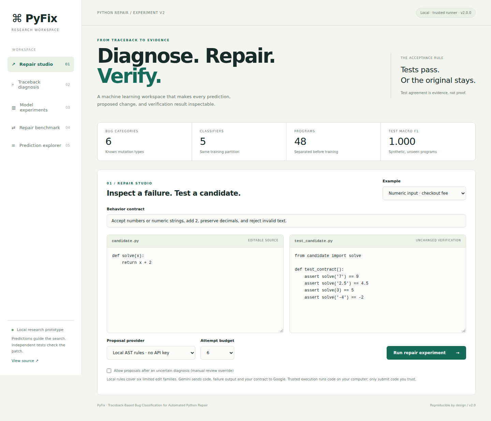

# PyFix · Research Workspace
### Traceback-Based Bug Classification for Automated Python Repair

A Python ML project with an inspectable repair studio, calibrated bug-category predictions, controlled feature experiments, and test-verified candidate search.

**Version 2:** 48 authored task programs, four disjoint program partitions, five classifier comparisons, three feature ablations, uncertainty checks, six AST repair families, paired repair experiments, and an external QuixBugs scope challenge. This is a small research prototype; synthetic scores are not production accuracy.

**Verified:** [GitHub Actions run](https://github.com/priyanka1vivek/pyfix/actions/runs/37340223036) passed 26 pytest tests, 10 core checks, Docker isolation/repair, and desktop/mobile browser checks. Live Gemini remains unverified without credentials.



## Run it on Windows

Download this repository with **Code → Download ZIP**, extract it and open the folder containing `requirements.txt` in VS Code. In its terminal:

```powershell
py -3.11 -m venv .venv
.\.venv\Scripts\python.exe -m pip install -r requirements.txt
.\.venv\Scripts\python.exe -m pyfix.cli generate
.\.venv\Scripts\python.exe -m pyfix.cli train
.\.venv\Scripts\python.exe -m pyfix.cli benchmark
$env:PYFIX_RUNNER="trusted"
.\.venv\Scripts\python.exe -m pyfix.cli serve
```

Open **http://localhost:8000**. No API key is required for local AST repair. Select any of the six examples and run the experiment. `trusted` executes code on your computer: use only code and tests you trust. Stop the server with Ctrl+C. Use Python 3.11 or newer; if 3.11 is not installed, substitute `py` for `py -3.11` after checking your version.

macOS/Linux:

```sh
python3 -m venv .venv
source .venv/bin/activate
pip install -r requirements.txt
python -m pyfix.cli generate
python -m pyfix.cli train
python -m pyfix.cli benchmark
PYFIX_RUNNER=trusted python -m pyfix.cli serve
```

## Explore the UI

- **Repair studio:** six examples, source and immutable external tests, behavior contract, attempt budget, optional manual override for uncertain diagnoses, patch diffs, verification history, downloadable audit JSON.
- **Traceback diagnosis:** ranked calibrated scores, rejection reasons, vocabulary overlap and supporting text features. A feature contribution is not a causal explanation.
- **Model experiments:** all five models, program bootstrap intervals, exception-only/traceback/traceback-plus-code ablations, Brier scores and log loss.
- **Repair benchmark:** classifier-guided versus unguided AST candidate search under identical budgets, with additional withheld input checks.
- **Prediction explorer:** inspect individual correct/incorrect and accepted/review predictions.

## What is ML, and what is not?

The learned component is TF-IDF text classification. Naive Bayes, logistic regression, linear SVM, random forest and AdaBoost are compared. Separate held-out programs fit sigmoid calibration. Validation macro F1 selects the classifier; the test split is reserved for final reporting.

Local repair is an explicit AST search over six edit families. The classifier restricts candidate generation to its predicted category. Uncertain or unsupported failures stop for review by default. Gemini can instead propose code using the predicted class and behavior contract. Neither repair provider is presented as a newly trained generative model.

## Dataset and experiments

`pyfix/catalog.py` defines 48 small task programs: invoices, temperature conversion, stock updates, optional fields, list traversals, ratios, helper calls and more. Each has a working implementation, a single mutation and input fixtures. Every clean program must run and every retained mutant must fail. Repeated inputs are deduplicated; the default corpus has **321 records**, not an artificially inflated count of renamed clones.

| Partition | Programs | Purpose |
|---|---:|---|
| Training | 24 | Fit TF-IDF and classifiers |
| Calibration | 6 | Fit sigmoid score calibration |
| Validation | 6 | Choose model and score threshold |
| Test | 12 | Report held-out results |

Inputs from one program stay together. Program IDs and exact module-source overlap are checked across partitions. The programs share mutation patterns, so this is not a guarantee against all semantic similarity. Source metadata, clean implementations and mutation labels never enter traceback-only classifier features.

**Feature ablation:** fixed logistic regression on exception text only, full traceback, and traceback plus broken module source. This shows what additional context contributes on this corpus, even if extra source does not improve the score.

**Calibration:** report multiclass Brier score and log loss before/after calibration. Only six independent calibration programs are available; calibrated scores still have substantial uncertainty.

**Selective prediction:** validation chooses a score threshold targeting at least 85% empirical accuracy at maximum coverage. An ambiguity margin, supported-exception list and vocabulary overlap check also apply. These rules can reject valid examples or accept unsupported ones. They are not a general unknown-bug detector.

**Repair ablation:** 12 held-out programs, same six-candidate budget, provider and visible tests for guided/unguided arms. Local guidance changes strategy selection; unguided candidates follow a fixed class ordering. This is sensitive to that ordering and does not establish an advantage over every alternative search policy. Additional withheld inputs are checked after a candidate passes; programs with only a None trigger have no separate hidden input and report null.

**External challenge:** four pinned, MIT-licensed QuixBugs tasks with upstream tests. Recursion and semantic failures lie outside the six labels. Report rejection behavior separately; do not describe these as production bugs or claim root-cause classification accuracy for them. See `benchmarks/quixbugs/PROVENANCE.md` and the retained upstream license.

## Docker execution

Docker is the default execution backend for submitted source. Install/start Docker, then:

```sh
docker build -f Dockerfile.runner -t pyfix-runner:1 .
```

Unset `PYFIX_RUNNER` or set it to `docker`, then start the server. Each run has no network, an unprivileged user, read-only code/root mounts, dropped capabilities, process/memory/CPU limits, and a timeout. This is not a hardened public multi-user sandbox. Captured output is capped when read, but backing output files are not quota-limited. Keep the API local. Python code can interfere with its own test process; unchanged test files alone do not make verification adversary-proof.

## Gemini

Copy `.env.example` to `.env`, set `GEMINI_API_KEY` and `GEMINI_MODEL` to values valid for your Google account, and restart. Choose Gemini in the UI. Never commit the key. Source, contract and failure output are sent to Google; failure output can contain test fragments. The independent test file itself is not rewritten by proposals. Live Gemini and guided-versus-unguided Gemini evaluation require your credentials and have not been claimed as measured results.

## Reproduce and test

```sh
python -m pyfix.cli generate
python -m pyfix.cli train
python -m pyfix.cli benchmark
python -m unittest discover -s tests -p stdlib_checks.py -v
python -m pytest -q
```

Set `PYFIX_TEST_DOCKER=1` to enable Docker integration tests after building the runner. GitHub Actions performs installation, generation, training, benchmark execution, core checks, pytest, Docker verification and a real-browser desktop/mobile check. It uploads experiment reports and screenshots as the `experiment-results` artifact. A workflow file is not evidence of success; inspect the latest run and [validation notes](docs/VALIDATION.md).

Model binaries are ignored by Git: train after cloning, and retrain after pulling a new version. Load only trusted joblib artifacts.

## Files

| File | Role |
|---|---|
| `pyfix/catalog.py`, `dataset.py` | Programs, fixtures, mutations, provenance |
| `pyfix/training.py` | Models, calibration, selection, ablations, error reports |
| `pyfix/proposals.py`, `repair.py` | Independent AST edits, optional Gemini, verified attempts |
| `pyfix/runner.py` | Docker/trusted process execution |
| `pyfix/benchmark.py` | Paired repair experiment and external challenge |
| `pyfix/app.py`, `static/` | Local API and interface |
| `tests/`, `scripts/browser_check.py` | Behavioral, Docker and browser checks |
| `artifacts/` | Actual measured reports and plots |
| `benchmarks/quixbugs/` | Pinned external code, upstream tests and license |

## Presentation and honest claims

The strongest demonstration is a traceable chain from failing tests to model prediction, candidate diff and verified outcome, backed by a controlled comparison. Do not claim perfect generalization, novelty of automated repair, or correctness proved by a passing test suite. See [methodology](docs/METHODOLOGY.md), [assessment text](docs/ASSESSMENT.md) and [viva guide](docs/VIVA.md).
